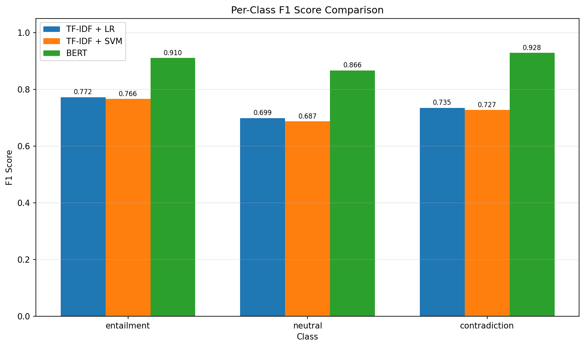
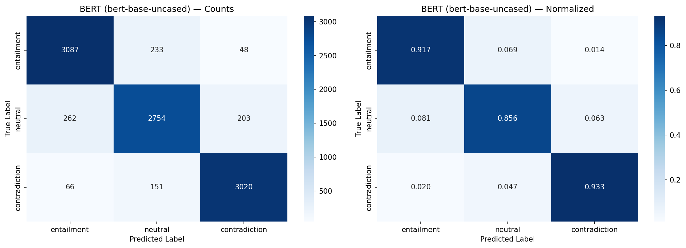
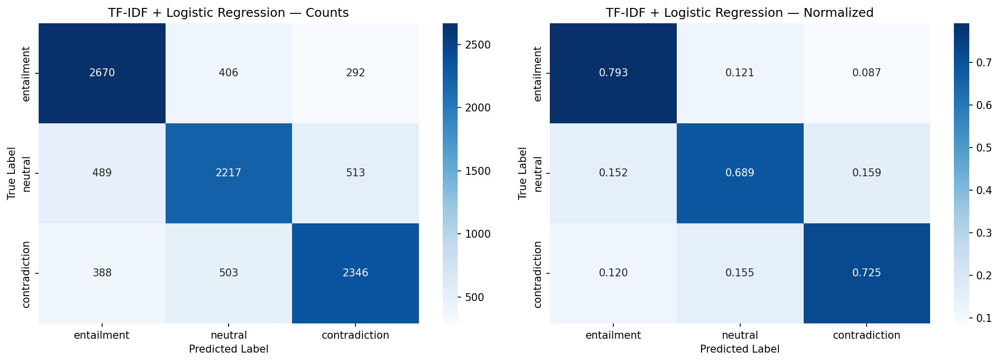
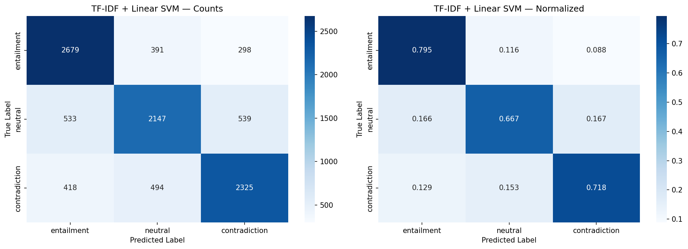

# Automated Contradiction Detection in News Articles

**Joel Adu-Kwarteng & Kishore Vasudevan**  
NLP Final Project — Spring 2026

## Overview

This project trains and evaluates three models on the SNLI dataset for 3-class Natural Language Inference (entailment, neutral, contradiction):

1. **TF-IDF + Logistic Regression** — baseline
2. **TF-IDF + Linear SVM** — baseline
3. **BERT (bert-base-uncased)** — fine-tuned transformer

## Project Structure

```
├── SNLI_Contradiction_Detection.ipynb  ← Main Colab notebook (run this!)
├── config.py                           ← All hyperparameters and paths
├── data_utils.py                       ← Data loading and TF-IDF feature engineering
├── baselines.py                        ← Logistic Regression and SVM training
├── bert_model.py                       ← BERT fine-tuning with HuggingFace Trainer
├── evaluation.py                       ← Metrics, confusion matrices, comparison tables
├── main.py                             ← CLI runner script (alternative to notebook)
└── README.md
```

## Quick Start (Google Colab)

1. Upload `SNLI_Contradiction_Detection.ipynb` to Google Colab
2. Set runtime to **GPU** (Runtime → Change runtime type → T4 GPU)
3. Run all cells — results save automatically to Google Drive under `NLP_Project/`

## Quick Start (Scripts)

```bash
# Upload all .py files to Colab or a GPU machine, then:
python main.py              # run full pipeline
python main.py --baselines  # baselines only
python main.py --bert       # BERT only
```

## Output (saved to Google Drive)

```
NLP_Project/
├── results/
│   ├── tfidf_lr_metrics.json
│   ├── tfidf_svm_metrics.json
│   ├── bert_metrics.json
│   ├── *_confusion_matrix.csv
│   ├── model_comparison.csv
│   └── model_comparison.tex        ← paste into LaTeX paper
├── figures/
│   ├── tfidf_lr_confusion_matrix.png
│   ├── tfidf_svm_confusion_matrix.png
│   ├── bert_confusion_matrix.png
│   └── f1_comparison_by_class.png
└── models/
    ├── tfidf_vectorizer.joblib
    ├── tfidf_lr.joblib
    ├── tfidf_svm.joblib
    └── bert_best/
```

## Key Design Decisions

- **TF-IDF interaction features**: Each pair is represented as `[P; H; |P−H|; P⊙H]` where the difference captures contradiction signals and the product captures entailment signals.
- **Full SNLI training**: ~550K examples after filtering no-gold-label entries.
- **BERT settings**: 3 epochs, batch size 32, lr 2e-5, FP16 mixed precision. Best model selected by validation macro F1.
- **Evaluation**: Per-class and macro precision/recall/F1, confusion matrices, cross-model agreement analysis.

## Results

### Overall Performance

| Model | Accuracy | Macro F1 | Train Time |
|-------|----------|----------|------------|
| TF-IDF + Logistic Regression | 73.63% | 73.52% | ~3 min |
| TF-IDF + Linear SVM | 72.79% | 72.64% | ~10 min |
| **BERT (bert-base-uncased)** | **90.20%** | **90.16%** | ~2 hr |

### Per-Class F1 Scores

| Model | Entailment | Neutral | Contradiction |
|-------|-----------|---------|---------------|
| TF-IDF + LR | 77.22% | 69.88% | 73.45% |
| TF-IDF + SVM | 76.56% | 68.69% | 72.67% |
| **BERT** | **91.02%** | **86.64%** | **92.81%** |

BERT outperforms both baselines by ~17 percentage points in macro F1. Neutral is the hardest class for all models. Contradiction is BERT's strongest class (92.81% F1).

### Figures

| | |
|---|---|
|  |  |
| F1 by class across all models | BERT confusion matrix |
|  |  |
| TF-IDF + LR confusion matrix | TF-IDF + SVM confusion matrix |

## Training Times (Actual, Free Colab T4)

| Model | Actual Time |
|-------|------------|
| TF-IDF + LR | ~3 min (179.7 s) |
| TF-IDF + SVM | ~10 min (575.5 s) |
| BERT (3 epochs) | ~2 hr (7426.9 s) |

## Requirements

```
datasets
transformers[torch]
scikit-learn
seaborn
matplotlib
pandas
numpy
scipy
joblib
```
